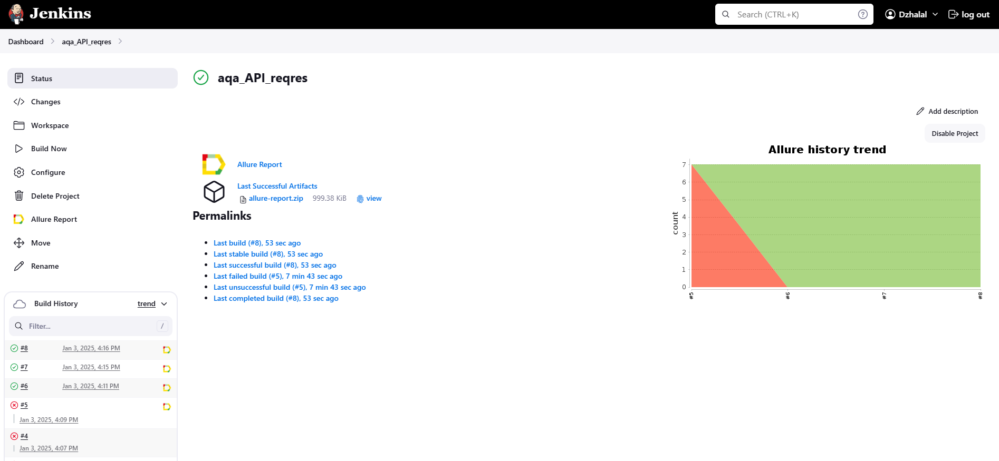
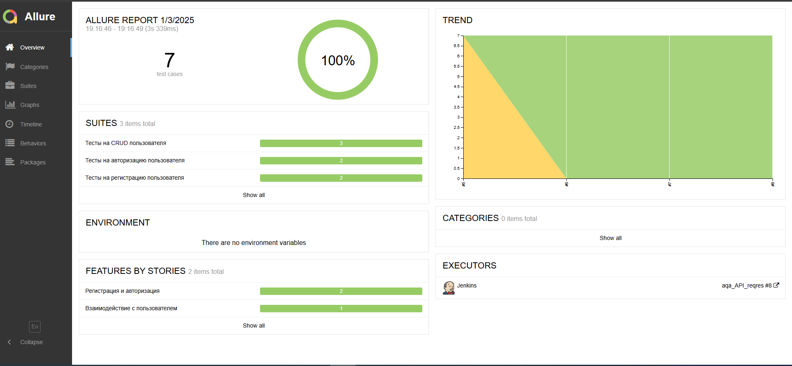
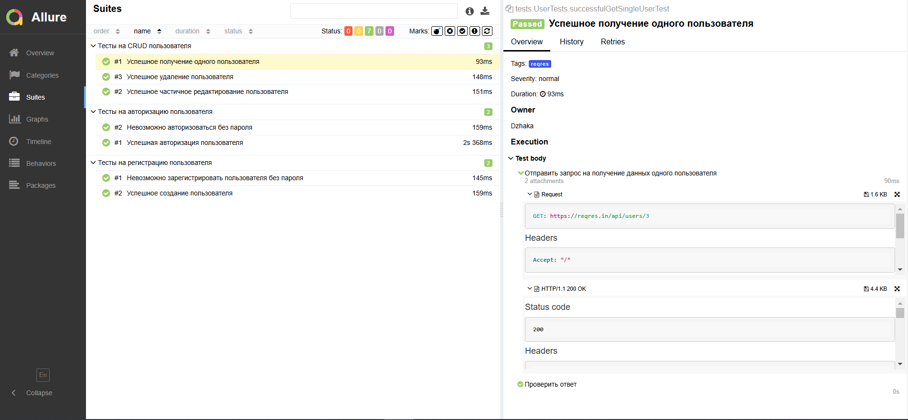
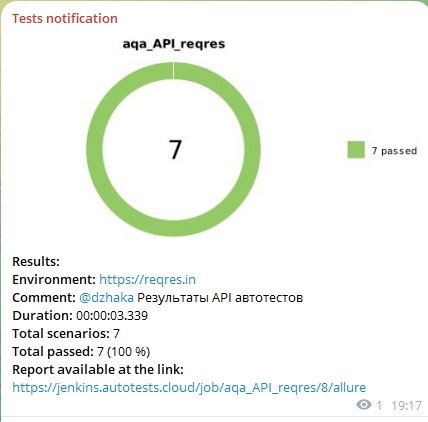

# Проект по автоматизации тестирования API для сайта [Reqres](https://reqres.in/)
<p align="center"><a href="https://reqres.in/"></a></p>

> Reqres - сервис, предоставляющий публичный API для практики тестирования и разработки

## Содержание:

- [Технологии и инструменты](#tools)
- [Тестовое покрытие](#cases)
- [Локальный запуск тестов](#localrun)
- [Запуск тестов в Jenkins](#remoterun)
- [Allure отчёт](#report)
- [Уведомления в Telegram](#telegram)


<a id="tools"></a>

## Технологии и инструменты:

<div align="center">
<a href="https://www.jetbrains.com/idea/"></a>
<a href="https://github.com/"></a>  
<a href="https://www.java.com/"></a>
<a href="https://gradle.org/"></a>  
<a href="https://junit.org/junit5/"></a>
<a href="https://rest-assured.io/"></a>
<a href="https://www.jenkins.io/"></a>
<a href="https://github.com/allure-framework/"></a>
<a href="https://telegram.org/"></a>
</div>

<p></p>

Автотесты для данного проекта написаны на <code>Java</code> с использованием библиотеки <code>REST-assured</code> для взаимодействия с REST api.

В качестве фреймворка для запуска тестов используется <code>Junit5</code>, а в качестве сборщика проекта - <code>Gradle</code>. Произведена настройка CI в <code>Jenkins</code>.

По результатам каждого тестового прогона создаётся <code>Allure</code> отчёт для визуализации результатов прогона.

После прогона тестов <code>Telegram</code> бот присылает сообщение с информацией о прошедшем прогоне

<a id="cases"></a>

## Тестовое покрытие:
### Регистрация пользователя
🔎 Успешное создание пользователя

🔎 Невозможно зарегистрировать пользователя без пароля


### Авторизация пользователя
🔎 Успешная авторизация пользователя

🔎 Невозможно авторизоваться без пароля


### Получение, редактирование, удаление пользователя
🔎 Успешное получение одного пользователя

🔎 Успешное частичное редактирование пользователя

🔎 Успешное удаление пользователя

<a id="localrun"></a>

##  Локальный запуск тестов
Для локального запуска тестов из IDE или из терминала необходимо выполнить следующую команду

```
gradle clean test
```

<a id="remoterun"></a>

## <a href="https://www.jenkins.io/"></a> Запуск тестов в [Jenkins](https://jenkins.autotests.cloud/job/aqa_API_reqres/)
Для запуска тестов в Jenkins нужно нажать на кнопку Build Now в соответствующей сборке

<p align="center">

</p>

<a id="report"></a>

## <a href="https://github.com/allure-framework/"></a>[Allure отчёт](https://jenkins.autotests.cloud/job/aqa_API_reqres/8/allure/)
### Графики

<p align="center">

</p>

### <a href="https://junit.org/junit5/"></a> Тесты

<p align="center">

</p>

<a id="testops"></a>

## <a href="https://telegram.org/"></a> Уведомление в Telegram

По результатам каждого прогона тестов в Jenkins отправляется сообщение в Telegram. Сообщение содержит информацию о прогоне, а также диаграмму со статистикой прохождения тестов.

<p align="center">

</p>

<a id="telegram"></a>